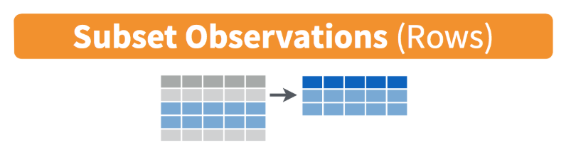
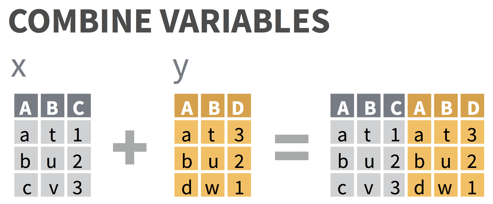
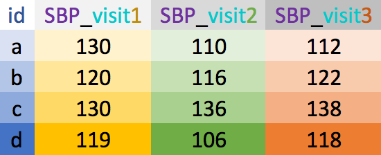

```{r setup, include=FALSE}
knitr::opts_chunk$set(echo = TRUE)
library(tidyverse)
```


# Learning objectives

<!-- TO-DO: update after finishing rest of slides -->

Part 1:
- What is data wrangling?
- A few good practices in R/RStudio
- What is tidy data?
- What is tidyverse?
- Manipulate data 

Part 2:
- Reshaping (long/wide format) data
- Join/merge data sets
- Data cleaning, including examples for dealing with:
  + Missing data
  + Strings/character vectors
  + Factors/categorical variables
  + Dates


---

# What is data wrangling?

.pull-left[
- "data janitor work"
- importing data
- cleaning data
- changing shape of data
]
.pull-right[
- fixing errors and poorly formatted data elements
- transforming columns and rows
- filtering, subsetting
]


<center></center>

[G. Grolemond & H. Wickham's R for Data Science](https://r4ds.had.co.nz/introduction.html)

---

# Good practices in RStudio

__Use projects__ ([read this](https://r4ds.had.co.nz/workflow-projects.html))
- Create an RStudio project for each data analysis project
- A project is associated with a directory folder
    + Keep data files there
    + Keep scripts there; edit them, run them in bits or as a whole
    + Save your outputs (plots and cleaned data) there

- Only use relative paths, never absolute paths
    + relative (good): `read_csv("data/mydata.csv")`
    + absolute (bad): `read_csv("/home/yourname/Documents/stuff/mydata.csv")`
    
__Advantages of using projects__
- standardize file paths
- keep everything together
- a whole folder can be shared and run on another computer


---

# Useful keyboard shortcuts

.pull-left[

action | mac | windows/linux
---| ---| ---
run code in script | cmd + enter | ctrl + enter 
`<-`| option + - | alt + -
`%>%` <br><font color="red">(covered later)</font>| cmd + shift + m | ctrl + shift + m
]

.pull-right[
Try typing (with shortcut) and running
```{r, eval=FALSE}
y <- 5
y
```
Now, in the console, press the up arrow.
]

## Others: ([see full list](https://support.rstudio.com/hc/en-us/articles/200711853-Keyboard-Shortcuts))

action | mac | windows/linux
---| ---| ---
interrupt currently executing command | esc | esc
in console, go to previously run code | up/down | up/down
keyboard shortcut help | option + shift + k | alt + shift + k

---
# Data frames vs. tibbles

.pull-left[
*Data frames* are a base 'table' in R
```{r}
data.frame(name = c("Sarah","Ana","Jose"), 
           rank = 1:3,
           age = c(35.5, 25, 58),
           city = c(NA,"New York","LA"))
```
]
.pull-right[
A *tibble* is a data frame but with perks
```{r}
tibble(name = c("Sarah","Ana","Jose"), 
       rank = 1:3,
       age = c(35.5, 25, 58),
       city = c(NA,"New York","LA"))
```
]

How are these two datasets different?


---

# Import data as a data frame (try this)


Base R functions import data as data frames (`read.csv`, `read.table`, etc)

```{r}
mydata_df <- read.csv("data/small_data.csv")
mydata_df
```

---

# Import data as a tibble (try this)

`tidyverse` functions import data as tibbles (`read_csv`, `read_excel()`, etc)

```{r}
mydata_tib <- read_csv("data/small_data.csv")
mydata_tib
```

---

# What are tidy data?

1. Each variable forms a column
2. Each observation forms a row 
3. Each value has its own cell


[G. Grolemond & H. Wickham's R for Data Science](https://r4ds.had.co.nz/tidy-data.html)

---

# Untidy data: example 1

```{r}
untidy_data <- tibble(
  name = c("Ana","Bob","Cara"),
  meds = c("advil 600mg 2xday","tylenol 650mg 4xday", "advil 200mg 3xday")
)
untidy_data
```

---

# Untidy data: example 2

```{r}
untidy_data2 <- tibble(
  name = c("Ana","Bob","Cara"),
  wt_07_01_2018 = c(100, 150, 140),
  wt_08_01_2018 = c(104, 155, 138),
  wt_09_01_2018 = c(NA, 160, 142)
)
untidy_data2
```


---
# Tidy data: example 1

You will learn how to do this!
```{r}
untidy_data %>% 
  separate(col = meds, into = c("med_name","dose_mg","times_per_day"), sep=" ") %>%
  mutate(times_per_day = as.numeric(str_remove(times_per_day, "xday")),
         dose_mg = as.numeric(str_remove(dose_mg, "mg")))
```


---

# Tidy data: example 2

You will learn how to do this!
```{r}
untidy_data2 %>% 
  gather(key = "date", value = "weight", -name) %>%
  mutate(date = str_remove(date,"wt_"),
         date = dmy(date))     # dmy() is a function in the lubridate package
```


---

# Tools for tidying data

- `tidyverse` functions
    + `tidyverse` is a [suite of packages](https://www.tidyverse.org/packages/) that implement `tidy` methods for data importing, cleaning, and wrangling
    + load the `tidyverse` packages by running the code `library(tidyverse)` 
        * see pre-workshop homework for code to install `tidyverse`

- Functions to easily work with rows and columns, such as
    + subset rows/columns
    + add new rows/columns
    + split apart or unite columns
    + join together different data sets (part 2)
    + make data _long_ or _wide_ (part 2)

- Often many steps to tidy data
    + string together commands to be performed sequentially 
    + do this using pipes `%>%`


<!-- TO-DO: are we adding new rows in this talk?-->

---

# How to use the pipe `%>%`

The pipe operator `%>%` strings together commands to be performed sequentially

```{r}
mydata_tib %>% head(n=3)      # prounounce %>% as "then"
```

- Always _first list the tibble_ that the commands are being applied to
- Can use __multiple pipes__ to run multiple commands in sequence
    + What does the following code do?

```{r, eval=FALSE}
mydata_tib %>% head(n=3) %>% summary()
```


---

# About the data

Data from the CDC's [Youth Risk Behavior Surveillance System (YRBSS) ](https://www.cdc.gov/healthyyouth/data/yrbs/index.htm)

- complex survey data
- national school-based survey 
    + conducted by CDC and state, territorial, and local education and health agencies and tribal governments
- monitors six categories of health-related behaviors 
    + that contribute to the leading causes of death and disability among youth and adults 
    + including alcohol & drug use, unhealthy & dangerous behaviors, sexuality, and physical activity
    + see [Questionnaires](https://www.cdc.gov/healthyyouth/data/yrbs/questionnaires.htm)
- the data in `yrbss_demo.csv` are a subset of data in the R package [`yrbss`](https://github.com/hadley/yrbss), which includes YRBSS from 1991-2013

- Look at your _Environment_ tab to make sure `demo_data` is already loaded

```{r, results=FALSE}
demo_data <- read_csv("data/yrbss_demo.csv")
```


---
class: center, middle, inverse

# Subsetting data




[tidyverse data wrangling cheatsheet](https://www.rstudio.com/wp-content/uploads/2015/02/data-wrangling-cheatsheet.pdf)


---

# `filter()` $\sim$ rows

filter data based on rows
.pull-left[
- math: `>`,  `<`,  `>=`,  `<=`
-  double = for "is equal to":  `==`
-  `&` (and) 
-  `|` (or)
- != (not equal)
]
.pull-right[
- `is.na()` to filter based on missing values
- `%in%` to filter based on group membership
- `!` in front negates the statement, as in 
    + `!is.na(age)` 
    + `!(grade %in% c("9th","10th"))`
]


```{r}
demo_data %>% filter(bmi > 20)
```
---

# Compare to base R

.pull-left[

- __Bracket method__: need to repeat tibble name
- Need to use `$` 
- Very nested and confusing to read
- Keeps `NA`s

```{r , eval=FALSE}
demo_data[demo_data$grade=="9th",]
```

]
.pull-right[
- __Pipe method__: list tibble name once
- No `$` needed since uses "non-standard evaluation": `filter()` knows `grade` is a column in `demo_data`
- Removes `NA`s
```{r , eval=FALSE}
demo_data %>% filter(grade=="9th")
```

]

---


# `filter()` practice

What do these commands do? Try them out:

```{r, eval=FALSE}
demo_data %>% filter(bmi < 5)
demo_data %>% filter(bmi/stweight < 0.5)    # can do math
demo_data %>% filter((bmi < 15) | (bmi > 50))
demo_data %>% filter(bmi < 20, stweight < 50, sex == "Male") # filter on multiple variables

demo_data %>% filter(record == 506901)      # note the use of == instead of just =
demo_data %>% filter(sex == "Female")
demo_data %>% filter(!(grade == "9th"))
demo_data %>% filter(grade %in% c("10th", "11th"))

demo_data %>% filter(is.na(bmi))
demo_data %>% filter(!is.na(bmi))
```


---

# Subset by columns


[tidyverse data wrangling cheatsheet](https://www.rstudio.com/wp-content/uploads/2015/02/data-wrangling-cheatsheet.pdf)

---

# `select()` $\sim$ columns

- select columns (variables)
- no quotes needed around variable names
- can be used to rearrange columns
- uses special syntax that is flexible and has many options

```{r}
demo_data %>% select(record, grade)
```

---

# Compare to base R

.pull-left[
- Need brackets 
- Need quotes around column names
```{r}
demo_data[, c("record","age","sex")]
```
]
.pull-right[
- No quotes needed and easier to read. 
- More flexible, either of following work:
```{r, results="hold"}
demo_data %>% select(record, age, sex)
demo_data %>% select(record:sex)
```
]


---

# Column selection syntax options

There are many ways to select a set of variable names (columns):

- `var1:var20`: all columns from `var1` to `var20`
- `one_of(c("a", "b", "c"))`: all columns with names in the specified character vector of names
- __Removing columns__
    + `-var1`: remove the column`var1`
    + `-(var1:var20)`: remove all columns from `var1` to `var20`
- __Select using text within column names__
    + `contains("date")`, `contains("_")`: all variable names that contain the specified string
    + `starts_with("a")` or `ends_with("last")`: all variable names that start or end with the specificed string
- __Rearranging columns__
    + use `everything()` to select all columns not already named
    + example: `select(var1, var20, everything())` moves the column `var20` to the second position

See other examples in the [data wrangling cheatsheet](https://www.rstudio.com/wp-content/uploads/2015/02/data-wrangling-cheatsheet.pdf).


---

# `select()` practice

Which columns are selected & in what order using these commands?  
First guess and then try them out.

```{r, eval=FALSE}
demo_data %>% select(record:sex)
demo_data %>% select(one_of(c("age","stweight")))

demo_data %>% select(-grade,-sex)
demo_data %>% select(-(record:sex))

demo_data %>% select(contains("race"))
demo_data %>% select(starts_with("r"))
demo_data %>% select(-contains("r"))

demo_data %>% select(record, race4, race7, everything())
```


---

# `rename()` $\sim$ columns

- renames column variables

```{r}
demo_data %>% rename(id = record)   # order: new_name = old_name
```

---

# Practice

```{r, eval=FALSE}
# Remember: to save output into the same tibble you would use <-
newdata <- newdata %>% select(-record)

# Useful to see what categories are available
demo_data %>% janitor::tabyl(race7)
```

Do the following data wrangling steps in order so that the output from the previous step is the input for the next step.
Save the results in each step as `newdata`.

<!-- removed following since uses `rename_all(toupper)` that we moved to end -->
<!-- 1. Convert all column names to upper case, save the result as `newdata`. -->
<!-- I updated the instructions so not using all caps, as well as the solution in the code chunk below -->

1. Import `demo_data.csv` in the `data` folder if you haven't already done so.

1. Filter `newdata` to only keep "Asian" or "Native Hawaiian/other PI" subjects that are in the 9th grade, and save again as `newdata`.

1. Filter `newdata` to remove subjects younger than 13, and save as `newdata`.

1. Remove the column `race4`, and save as `newdata`.

1. How many rows does the resulting `newdata` have? How many columns?


---

# Make new variables


[tidyverse data wrangling cheatsheet](https://www.rstudio.com/wp-content/uploads/2015/02/data-wrangling-cheatsheet.pdf)


---

# `mutate()`

Use `mutate()` to add new columns to a tibble
* many options in how to define new column of data


```{r}
newdata <- demo_data %>% 
  mutate(height_m = sqrt(stweight / bmi))   # use = (not <- or ==) to define new variable

newdata %>% select(record, bmi, stweight)
```


---

# `mutate()` practice

What do the following commands do?  
First guess and then try them out.

```{r, eval=FALSE}
demo_data %>% mutate(bmi_high = (bmi > 30))

demo_data %>% mutate(male = (sex == "Male"))
demo_data %>% mutate(male = 1 * (sex == "Male"))

demo_data %>% mutate(grade_num = as.numeric(str_remove(grade, "th")))
```


---

# `case_when()` with `mutate()`

Use `case_when()` to create multi-valued variables that depend on an existing column 
- Example: create BMI groups based off of the `bmi` variable
```{r}
demo_data2 <- demo_data %>%
  mutate(
    bmi_group = case_when(
      bmi < 18.5 ~ "underweight",               # condition ~ new_value
      bmi >= 18.5 & bmi <= 24.9 ~ "normal",
      bmi > 24.9 & bmi <= 29.9 ~ "overweight",
      bmi > 29.9 ~ "obese")
    )
demo_data2 %>% select(bmi, bmi_group) %>% head()
```


---

# `separate()` and `unite()`

.pull-left[
`separate()`: one column to many
- when one column has multiple types of information
- removes original column by default

```{r}
demo_data %>% 
  separate(age,c("a","y","o","w","w2"),
           sep = " ") %>%
  select(a:w2)
```

]
.pull-right[
`unite()`: many columns to one
- paste columns together using a separator
- removes original columns by default
```{r}
demo_data %>% 
  unite("sexgr", sex, grade, sep=":") %>%
  select(sexgr)
```

]
---

# `separate()` and `unite()` practice

What do the following commands do?

First guess and then try them out.

```{r, eval=FALSE}
demo_data %>% separate(age, c("agenum","yrs"), sep = " ")
demo_data %>% separate(age, c("agenum","yrs"), sep = " ", remove = FALSE)

demo_data %>% separate(grade, c("grade_n"), sep = "th")
demo_data %>% separate(grade, c("grade_n"), sep = "t")
demo_data %>% separate(race4, c("race4_1", "race4_2"), sep = "/")

demo_data %>% unite("sex_grade", sex, grade, sep = "::::")
demo_data %>% unite("sex_grade", sex, grade)       # what is the default `sep` for unite?
demo_data %>% unite("race", race4, race7)          # what happens to NA values?

```

---
class: center, middle, inverse

# More commands to filter rows

<!-- TO-DO: rename? -->

---

# Remove rows with missing data

`na.omit` removes *all* rows with *any* missing (`NA`) values in *any* column

```{r}
demo_data %>% na.omit()
```

We will discuss dealing with missing data more in part 2

---

# Remove rows with duplicated data

`distinct()` removes rows that are duplicates of other rows

```{r}
data_dups <- tibble(
  name = c("Ana","Bob","Cara", "Ana"),
  race = c("Hispanic","Other", "White", "Hispanic")
)
```

.pull-left[
```{r}
data_dups
```
]
.pull-right[
```{r}
data_dups %>% distinct()
```
]

---

# Order rows: `arrange()`

Use `arrange()` to order the rows by the values in specified columns

```{r}
demo_data %>% arrange(bmi, stweight) %>% head(n=3)

demo_data %>% arrange(desc(bmi), stweight) %>% head(n=3)
```


---

# Practice

Do the following data wrangling steps in order so that the output from the previous step is the input for the next step.
Save the results in each step as `newdata`.

1. Import `demo_data.csv` in the `data` folder if you haven't already done so.

1. Create a variable called `grade_num` that has the numeric grade number (use `as.numeric()`).

1. Filter the data to keep only students in grade 11 or higher.

1. Filter out rows when `bmi` is `NA`.

1. Create a binary variable called `bmi_normal` that is equal to 1 when `bmi` is between 18.5 to 24.9 and 0 when it is outside that range.

1. Arrange by `grade_num` from highest to lowest

1. Save all output to `newdata`.


---
# 15 Minute Break
---

# Learning objectives

<!-- TO-DO: update after finishing rest of slides -->
.pull-left[
Previously, in Part 1:
- What is data wrangling?
- A few good practices in R/RStudio
- What is tidy data?
- What is tidyverse?
- Manipulate data 
]
.pull-right[
Part 2:
- Summarizing data
- Combine (join) data sets
- Reshaping data: wide vs. long formats 
- Data cleaning:
  + Missing data
  + Strings/character vectors
  + Dates
  + Factors
  + Messy names
]
<!-- + Factors/categorical variables -->
---

# Review Part 1: manipulating data

## Columns 

- `select()` to subset columns
- `rename()` to rename columns
- `mutate()` to add new columns or change values within existing columns
  + `separate()` and `unite()` are shortcuts for specific `mutate` type operations

## Rows 

- `filter()` to subset rows
  + `na.omit()` and `distinct()` are shortcuts for specific `filter` type operations
- `arrange()` to order the data

---

# Numerical data summaries: `summarize()`

- We can summarize data as a whole, or in groups with `group_by()`
- `group_by()` is very powerful, see [data wrangling cheatsheet](https://www.rstudio.com/wp-content/uploads/2015/02/data-wrangling-cheatsheet.pdf)
- Can also use `summarize_at()`, `summarize_if()`, `summarize_all()`

.pull-left[
```{r}
# summary of all data as a whole
demo_data %>% 
  summarize(bmi_mean =mean(bmi,na.rm=TRUE), #<<
            bmi_sd = sd(bmi,na.rm=TRUE)) #<<
```

What does `na.rm=TRUE` do and what happens if we leave it out?
]

.pull-right[
```{r}
# summary by group variable
demo_data %>% 
  group_by(grade) %>% #<<
  summarize(n_per_group = n(), 
            bmi_mean =mean(bmi,na.rm=TRUE),
            bmi_sd = sd(bmi,na.rm=TRUE))
```
]

---

# Practice

Do the following data wrangling steps in order so that the output from the previous step is the input for the next step.
Save the results in each step as `newdata`.

1. Import `demo_data.csv` in the `data` folder if you haven't already done so.

1. Using `group_by()`, calculate the total number of observations by the `race4` variable.

---

class: center, inverse, middle

# Combining data sets


<center>
<br>
   be careful!!!<br>
<a href="https://gauss.inf.um.es/tabular/www/data-transformation.pdf">dplyr data transformation cheatsheet</a>
</center>


---

# Rows (cases): paste data below each other 

`bind_rows()` combines rows from different data sets  
& accounts for different column names

```{r, echo=FALSE}
data1 <- tibble(id = 1:2, name = c("Nina","Yi"), height=c(2, 1), age=c(4,2))
data2 <- tibble(id = 7:9, name = c("Bo","Al","Juan"), height=c(2, 1.7, 1.8), years=c(3,1,2))
```


.pull-left[
```{r}
data1
```

```{r}
data2
```
]
.pull-right[
```{r}
bind_rows(data1,data2, .id = "group") #<< 
```

<center><br>
<a href="https://gauss.inf.um.es/tabular/www/data-transformation.pdf">dplyr data transformation cheatsheet</a>
</center>
]

---
# *`join`*ing your data sets

.pull-left[
- `Join` uses overlapping or selected columns to combine two or more data sets.
- Also called "merging" or "mutating join". 
- Function names are based off of SQL operations for databases.

<center>

</center>
]

.pull-right[
<center>
<br>
<a href="https://gauss.inf.um.es/tabular/www/data-transformation.pdf">dplyr data transformation cheatsheet</a>
</center>
]

---

# `join` options visually

<center><br>
<a href="https://twitter.com/yutannihilation/status/551572539697143808">Hiroaki Yutani</a></center>

---

# Most commonly used: `left_join()`

- `left_join(x,y)` includes all observations in `x`, regardless of whether they match ones in `y` or not.
- It includes all columns in `y`, but only rows that match `x`'s observations.

.pull-left[
```{r, results="hold"}
df1 <- tibble(a = c(1, 2), b = 2:1)
df2 <- tibble(a = c(1, 3), c = 10:11)
df1
df2
```
]
.pull-right[
```{r}
left_join(df1, df2)
```

- Which common column(s) were used to merge the datasets?  
- What if we want to specify which columns to join by when merging?  
see next slide...
]
---

# Which columns will be used to join?

- If no columns are specified to join by, then *all* overlapping (intersecting) column names will be used
- Often we want to specify which columns to use, 
    + and also how to rename duplicated columns that were not merged

.pull-left[
<center>

</center>
]

.pull-right[
<center>
<br>
<a href="https://gauss.inf.um.es/tabular/www/data-transformation.pdf">dplyr data transformation cheatsheet</a>
</center>
]

---

# Check for overlapping column names

```{r , include=FALSE}
qn_data <- read_csv("data/yrbss_qn.csv")
```

Goal: merge the demographics (`demo_data`) and questionnaire (`qn_data`) together.

What column names do these datasets have in common?

```{r , eval=FALSE}
qn_data <- read_csv("data/yrbss_qn.csv")
```

```{r}
colnames(demo_data)
colnames(qn_data)
intersect(colnames(demo_data), colnames(qn_data)) #<<
```


---

# Merge `demo_data` and `qn_data` together


.pull-left[
Let's do a full join so that we keep all data from both datasets

```{r}
merged_data <- 
  full_join(demo_data, qn_data, 
            by = "record")

# Check dimensions of original and new datasets
```

]
.pull-right[
```{r}
dim(demo_data); dim(qn_data); dim(merged_data) 
```
]


```{r}
merged_data
```


---

# Learn more about `join`ing data

- [Two-table verbs vignette for `dplyr` package](https://dplyr.tidyverse.org/articles/two-table.html)
- [Jenny Bryan's STAT545 dplyr cheatsheet for join](https://stat545.com/bit001_dplyr-cheatsheet.html)
- [R for Data Science's "Relational data" chapter (great diagrams)](https://r4ds.had.co.nz/relational-data.html)

---

class: center, middle, inverse

# Reshaping data 


wide vs. long

---

# Wide vs. long data

<!-- TO DO: define, show pic -->
- __Wide__ data has one row per subject, with multiple columns for their repeated measurements
- __Long__ data has multiple rows per subject, with one column for the measurement variable and another indicating from when/where the repeated measures are from

.pull-left[
wide  

]
.pull-right[
long  

]

---

# Example wide dataset

Copy and paste the code below into R to create this example dataset

```{r}
BP_wide <- tibble(id = letters[1:4],
                     sex = c("F", "M", "M", "F"),
                     SBP_v1 = c(130, 120, 130, 119),
                     SBP_v2 = c(110, 116, 136, 106),
                     SBP_v3 = c(112, 122, 138, 118))
BP_wide
```

- What do you think the data in the table are measures of?
- How can we tell the data are wide?


---

# Wide to long: `pivot_longer()`


.pull-left[
```{r}
BP_wide
```

`pivot_longer` lengthens the data by converting columns into rows to make the data long. Need to __specify__:
- __new column names__
    + __names__: stores row names of wide data's gathered columns 
    + __values__: stores data values
- __which columns to lengthen__
]
.pull-right[
```{r}
BP_long <- BP_wide %>% 
  pivot_longer(names_to = "visit", 
               values_to = "SBP", 
               cols = SBP_v1:SBP_v3)
BP_long
```
]


<!--    -->
<!-- [data wrangling cheatsheet](https://www.rstudio.com/wp-content/uploads/2015/02/data-wrangling-cheatsheet.pdf) -->


---

# Long to wide: `pivot_wider()`

<!--    -->
<!-- [data wrangling cheatsheet](https://www.rstudio.com/wp-content/uploads/2015/02/data-wrangling-cheatsheet.pdf) -->


.pull-left[
```{r}
BP_long
```

]
.pull-right[
`pivot_wider` widens rows into columns to make the data wide. Need to __specify__ which columns in the long data to use:
- __names__ column: has the variable names 
- __values__ column: has the data values
    
```{r}
BP_wide2 <- BP_long %>% 
  pivot_wider(names_from = "visit", 
              values_from = "SBP")
BP_wide2
```
]


---

# Practice

Copy and paste the code below into R to create the dataset `DBP_wide`

```{r}
DBP_wide <- tibble(id = letters[1:4],
                  sex = c("F", "M", "M", "F"),
                  v1.DBP = c(88, 84, 102, 70),
                  v2.DBP = c(78, 78, 96, 76),
                  v3.DBP = c(94, 82, 94, 74),
                  age=c(23, 56, 41, 38)
                  )
```

1. Make `DBP_wide` into a long dataframe based on the repeated DBP columns and save it as `DBP_long`.
1. Clean up the visit column of `DBP_long` so that the values are 1, 2, 3, and save it as `DBP_long`.

1. Make `DBP_long` wide with column names `visit.1, visit.2, visit.3` for the DBP values, and save it as `DBP_wide2`.

1. Join `DBP_long` with `BP_long2` so that we have one data frame with columns id, sex, visit, SBP, DBP, and age. Save this as `BP_both_long`.


---

class: center, middle, inverse

# Data cleaning

## (messy NAs, names, strings, dates, factors)

---

# Removing missing data: `drop_na()`

<!-- These examples might be clearer with a small dataset and showing what the outcomes are. -->


.pull-left[

A small data example:

```{r}
mydata <- tibble(id = 7:9, 
                 name = c("Bo","Al","Juan"), 
                 height = c(2, NA, 1.8), 
                 years = c(51,35,NA))
mydata
```
]

.pull-right[

Remove *all* rows with **any missing data**

```{r}
mydata %>% drop_na()
```

Remove rows with `NA` in **selected columns**

```{r}
mydata %>% drop_na(height)
```
]


---

# Replace `NA`s with another value: `replace_na()`


.pull-left[
Use with `mutate()`
```{r}
mydata
```

]
.pull-right[
```{r}
mydata %>% 
  mutate(height = replace_na(height, 999), #<<
         years = replace_na(years, 0) ) #<<
```
]

---

# Working with character strings

- [Use the package `stringr`](https://stringr.tidyverse.org/) (loaded with `tidyverse`)
- Paste strings or values together [with package `glue`](https://glue.tidyverse.org/) (installed, not loaded w/ `tidyverse`)
- *advanced tip*: learn ["regular expressions"](https://stringr.tidyverse.org/articles/regular-expressions.html) ([regex](https://xkcd.com/208/)) for pattern matching (see [cheatsheet](https://www.rstudio.com/resources/cheatsheets/#stringr)) and matching multiple characters/strings at once

<center></center>
[stringr cheatsheet](https://www.rstudio.com/resources/cheatsheets/#stringr)


---

# Wrangle dates with `lubridate`

.pull-left[
- Convert characters to special "Date" type
- Convert *terrible excel date formats* into workable data
- Easy date magic examples:
    + add and subtract dates
    + convert to minutes/years/etc
    + change timezones
    + add 1 month to a date...
- [`lubridate` cheat sheet](https://www.rstudio.com/resources/cheatsheets/#lubridate)
- `read_csv` and `read_excel` etc automatically import dates correctly

]


---

# What kind of date do you have?

.pull-left[
<center></center>
[`lubridate` cheat sheet](https://www.rstudio.com/resources/cheatsheets/#lubridate)
]
.pull-right[
```{r}
timedata <- 
 tibble(name = c("Yi","Bo","DJ"), 
        dob=c("10/31/1952","1/12/1984","2/02/2002"))
timedata %>% 
  mutate(dob_date = mdy(dob),
         dob_wrong = dmy(dob)) # wrong order
```
]

---
# Math with dates

```{r}
timedata %>% mutate(
  dob = mdy(dob),                            # convert to a date
  dob_year = year(dob),                      # extract the year
  time_since_birth = dob %--% today(),       # create an "interval"
  age = time_since_birth %/% years(1),       # modulus on "years"
  dobplus = dob + days(10)                   # add 10 days
  )                  
```

---

# Factors - categorical data

.pull-left[
- Clean and order factors with `forcats` package
- See [`forcats` cheatsheet](https://www.flutterbys.com.au/stats/downloads/slides/figure/factors.pdf)
and [`forcats` vignette](https://forcats.tidyverse.org/)
]
.pull-right[
<center></center>
]

---

# `forcats` examples - specify levels `fct_relevel()`

.pull-left[
```{r}
mydata <- tibble(
  id = 1:4, 
  grade=c("9th","10th","11th","9th")) %>%
  mutate(grade_fac = factor(grade)) #<<
levels(mydata$grade_fac)
mydata %>% arrange(grade_fac)
```

]

.pull-right[

```{r}
mydata <- mydata %>% 
  mutate(
    grade_fac = #<<
      fct_relevel(grade_fac, #<<
                  c("9th","10th","11th"))) #<<
levels(mydata$grade_fac)
mydata %>% arrange(grade_fac)
```

]

---

# `forcats` examples - collapse levels

```{r}
mydata <- tibble(loc = c("SW","NW","NW","NE","SE","SE"))

mydata %>% mutate(
  loc_fac = factor(loc),
  loc2 = fct_collapse(loc_fac,                         # collapse levels #<<
                      south = c("SW","SE"), #<<
                      north = c("NE","NW")), #<<
  loc3 = fct_lump(loc_fac, n=2, other_level = "other") # most common 2 levels + other
  )
```

---

class: center, middle, inverse

# This was a *lot*, but learning R gets easier!


---

# Grammar of the `tidyverse`

The 6 most commonly used functions and the pipes (`%>%` or `|>`)

1. `filter()`: pick out observations based on their values
1. `select()`: pick certain columns by name
1. `group_by()`: group observations based on a variable
1. `arrange()`: reorder observations based on a variable
1. `summarize()`: summarize observations based on some function
1. `mutate()`: create new variables with function of existing variables

The major transformation operations

1. `left_join`: joins two data sets together
1. `pivot_longer` and `pivot_wider`: transforms your data


---
# Resources - `tidyverse` & data wrangling

Links

- [Learn the tidyverse](https://www.tidyverse.org/learn/)
- [Data wrangling cheatsheet](https://www.rstudio.com/wp-content/uploads/2015/02/data-wrangling-cheatsheet.pdf)

Some of this is drawn from materials in online books/lessons:

- [R for Data Science](https://r4ds.had.co.nz/index.html) - by Garrett Grolemund & Hadley Wickham
- [Modern Dive](https://moderndive.com/) - An Introduction to Statistical and Data Sciences via R by Chester Ismay & Albert Kim
- ["Tidy Data" by Hadley Wickham](https://vita.had.co.nz/papers/tidy-data.pdf)


